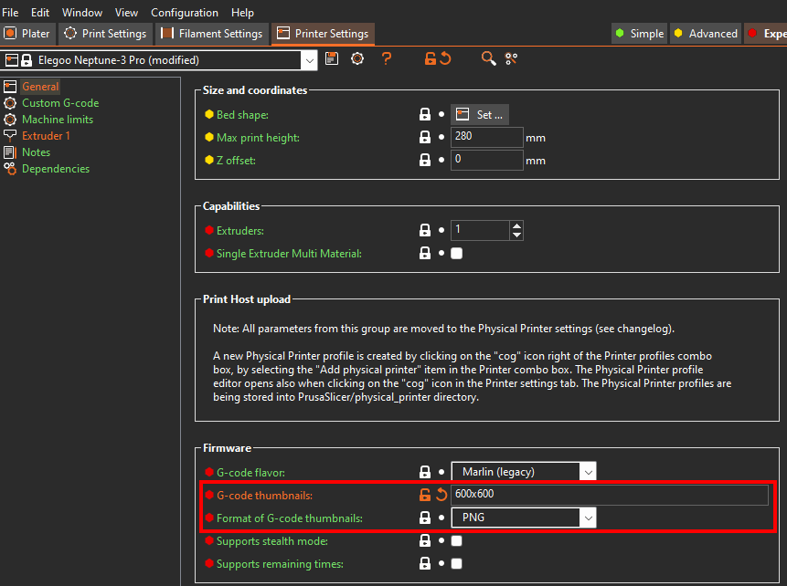
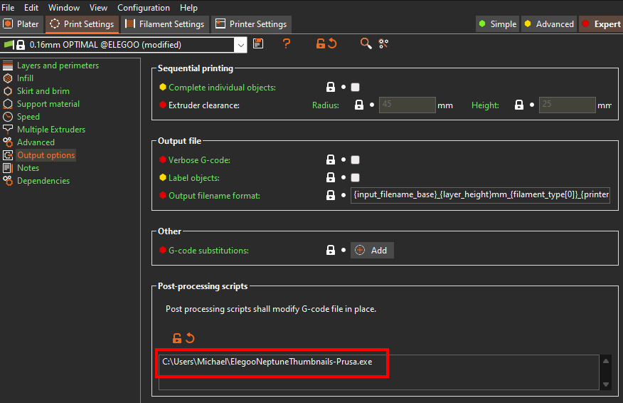

# Elegoo Neptune Thumbnails Post Processing Script For PrusaSlicer

[](https://www.gnu.org/licenses/agpl-3.0)

## Support This Project

If you like this post processing script, consider supporting me :)

[](https://www.buymeacoffee.com/molodos)

## General Info

> **Note:** This is a lite version of
> the [ElegooNeptuneThumbnails plugin for Cura 5.X](https://github.com/Molodos/ElegooNeptuneThumbnails). For all
> features,
> use Cura :)

PrusaSlicer post-processing script for adding gcode thumbnail images for Elegoo Neptune printers. The following models
are supported (for other models, see [FAQ](#faq)):

- Elegoo Neptune 4
- Elegoo Neptune 4 Pro
- Elegoo Neptune 4 Plus
- Elegoo Neptune 4 Max
- Elegoo Neptune 3 Pro
- Elegoo Neptune 3 Plus
- Elegoo Neptune 3 Max
- Elegoo Neptune 2
- Elegoo Neptune 2S
- Elegoo Neptune 2D
- Elegoo Neptune X
- Elegoo OrangeStorm Giga (beta)

> **Note:** If you have some idea on how to improve the post processing script or found a bug, feel free to create
> a [GitHub issue](https://github.com/Molodos/ElegooNeptuneThumbnails-Prusa/issues/new/choose) for that

<p float="left">
   
   
</p>

## Installation

1) Download the post processing script binary for Windows
   from [GitHub](https://github.com/Molodos/ElegooNeptuneThumbnails-Prusa/releases/latest) if you are using another
   operating system, you have to compile the script yourself as described in [Packaging Guide](#packaging-guide)
2) Place the binary somewhere on your system and remember the path (
   e.g. `C:\Users\Michael\ElegooNeptuneThumbnails-Prusa.exe`)
3) Set the thumbnail generation in PrusaSlicer to 600x600
   PNG 
4) Configure the path to the post-processing script binary in
   PrusaSlicer 
5) If it isn't working, check the [FAQ](#faq)

## FAQ

### Is there a Cura version of this plugin?

Yes, check out the [ElegooNeptuneThumbnails plugin for Cura 5.X](https://github.com/Molodos/ElegooNeptuneThumbnails),
which is the extended version of this pos processing script.

### I did not use the official Neptune printer preset in PrusaSliceer, what to do?

The script cannot auto-detect your printer when doing so. To manually set the printer model, use the
parameter `--printer=<printer_model>` after the path of the processing script in the PrusaSlicer settings. It should
look like `C:\Users\Michael\ElegooNeptuneThumbnails-Prusa.exe --printer=NEPTUNE4PRO`. Allowed values are the following:

NEPTUNE4, NEPTUNE4PRO, NEPTUNE4PLUS, NEPTUNE4MAX, NEPTUNE3PRO, NEPTUNE3PLUS, NEPTUNE3MAX, NEPTUNE2, NEPTUNE2S,
NEPTUNE2D, NEPTUNEX and ORANGESTORMGIGA

### Does the "normal" Neptune 3 support this plugin?

The "normal" Neptune 3 doesn't support displaying thumbnails, I have talked with Elegoo as there were many people asking
for it.

### Thumbnails are not generated. What to do?

Make sure, that you have followed the installation steps correctly.

### Why do thumbnails not change when printing another gcode file?

There seems to be a bug in older printer firmware versions which causes the thumbnail to not update if you start a print
right after the last one ended. Restarting the printer in between prints seems to fix that. If this is the case for you,
check your printer for firmware updates, which might fix the bug.

### Why do I get errors and the thumbnail does not work on MacOS using an M-Series chip?

Unfortunately I am dependent of the official Elegoo Cura binaries and as there are no binaries for the MacOS M series
chips, I am not able to provide support for those.

## Packaging Guide

### For Macs with M-series chips

If you have an arm64 mac, you will need to build an executable inside of a x86_64 python environment. The easiest way is
with [miniconda](https://formulae.brew.sh/cask/miniconda):

```
conda create -p ./my_x86_env -y
conda activate ./my_x86_env
conda config --env --set subdir osx-64
conda install python=3.11 -y
```

Then, follow the steps for other systems.

### Other systems

1) Install requirements `pip install -r requirements.txt`
2) Create binary for your system:
   ```shell
   pyinstaller --onefile --name="ElegooNeptuneThumbnails-Prusa" elegoo_neptune_thumbnails.py
   ```
3) Binary is in `dist` folder

## License

This repository uses code snippets and image encoding binaries from Elegoo Cura MKS Plugin and is therefore released
under the **AGPL v3** license.
